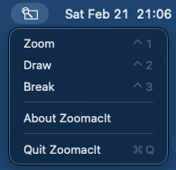

<p align="center">
  
</p>

<p align="center"><a href="README.md">English</a> | 日本語</p>

---
ZoomacIt は [Windows 版 ZoomIt](https://learn.microsoft.com/ja-jp/sysinternals/downloads/zoomit) にインスパイアされた、ネイティブ macOS メニューバーアプリです。
ZoomIt との機能互換を目指しており、システム全体で使えるホットキー、スムーズなズーム、画面上へのアノテーション機能を、最小限の権限で提供します。

<video src="images/demo_s.mov" autoplay loop muted playsinline width="600"></video>

[🎥 高画質で見る](images/demo.mp4)

## インストール

1. [Releases](https://github.com/07JP27/ZoomacIt/releases) から最新の `.dmg` をダウンロード
2. `.dmg` を開き、**ZoomacIt.app** を **Applications** フォルダにドラッグ
3. 「Appleは、“ZoomacIt”にMacに損害を与えたり、プライバシーを侵害する可能性のあるマルウェアが含まれていないことを検証できませんでした。」という警告が表示された場合は、以下のコマンドで検疫フラグを解除できます。本リポジトリのコードの内容を確認の上、自己責任で実行してください。
   ```bash
   xattr -cr /Applications/ZoomacIt.app
   ```
4. Applications から ZoomacIt を起動
5. プロンプトが表示されたら **画面収録** 権限を許可

## 現在の機能カバレッジ
| 機能 | 状態 |
|---|---|
|ズーム（静止画ズーム）|✅|
|ズーム（ライブズーム）||
|ドロー|✅|
|テキスト|✅|
|デモタイプ||
|休憩タイマー|✅|
|スニップ||
|録画||

## 機能詳細

各機能はグローバルホットキーまたはメニューバーのアイコンから起動できます。
メニューバーのアイコンをクリックすると、以下のようなメニューが表示されます。



### ズーム

**⌃1**（Control+1）を押すとズームモードに入ります。画面がキャプチャされ、ズームイン・アウトやパンが可能です。

#### 操作

| 入力 | アクション |
|---|---|
| マウス移動 | パン |
| スクロールホイール / ↑↓ | ズームイン / ズームアウト |
| クリック | ドローモードに入る（ズーム中の画面が描画キャンバスになります） |
| Escape | ズームモードを終了（ドローから入った場合はズームに戻る） |
| 右クリック | ズームモードを終了 |

#### ズーム → ドロー → ズームの流れ

ズームモード中にクリックすると、ズーム中の画面の上でドローモードに入ります。ドローモードで **Escape** を押すとズームモードに戻ります（テキストモードと同様の2段階解除）。もう一度 **Escape** を押すとズームを完全に終了します。

### ドロー

**⌃2**（Control+2）を押すとドローモードに入ります。画面がフリーズし、その上に描画できます。

#### 描画

| 入力 | アクション |
|---|---|
| ドラッグ | フリーハンド描画 |
| Shift + ドラッグ | 直線 |
| Control + ドラッグ | 矩形 |
| Tab + ドラッグ | 楕円 |
| Shift + Control + ドラッグ | 矢印 |

#### 色

| キー | 色 |
|---|---|
| R | 赤（デフォルト） |
| G | 緑 |
| B | 青 |
| O | オレンジ |
| Y | 黄 |
| P | ピンク |
| Shift + 色キー | 蛍光ペンモード |

#### ツール

| キー | アクション |
|---|---|
| T | テキスト入力モード |
| X | ぼかし（弱） |
| Shift + X | ぼかし（強） |
| ⌃ + スクロールホイール | ペン幅の変更 |
| E | すべて消去 |
| W | ホワイトボード背景 |
| K | ブラックボード背景 |

#### アクション

| キー | アクション |
|---|---|
| ⌘Z | 元に戻す |
| ⌘C | クリップボードにコピー |
| ⌘S | ファイルに保存 |
| Space | カーソルを中央に移動 |
| Escape | テキストモード終了（テキスト確定）/ ドローモード終了 |
| 右クリック | ドローモード終了 |

#### テキストモード

**T** を押すとテキストモードに入ります。任意の場所をクリックしてテキストフィールドを配置し、入力を開始します。

- **別の位置をクリック** — 現在のテキストが確定（ラスタライズ）され、新しいテキストフィールドが配置されます
- **Escape** — 現在のテキストを確定し、ペンモードに戋ります（ドローモードは継続）
- **スクロールホイール** — フォントサイズ変更
- **色キー**（R/G/B/O/Y/P）— テキストの色を変更
- **右クリック** — 現在のテキストを確定してドローモードを終了

### 休憩タイマー

**⌃3**（Control+3）を押すと休憩タイマーを開始します。全画面のカウントダウンが表示され、デフォルトの時間（10分）で即座にカウントダウンが始まります。

#### タイマー操作

| 入力 | アクション |
|---|---|
| ↑ | 1分追加 |
| ↓ | 1分減少 |
| R / G / B / O / Y / P | タイマーの文字色を変更 |
| Escape | タイマーを終了 |

#### 動作

- ホットキーを押した瞬間にタイマーが開始します（確認ダイアログなし）
- カウントダウン中でも ↑/↓ で時間を調整できます
- タイマーが **0:00** になっても画面は消えず、経過時間が下に表示されます（例: `0:00 (1:15)`）
- 他のアプリに切り替えてもタイマーはバックグラウンドで継続動作します
- メニューバーアイコン → **Break** からも起動できます
- ドローモード（⌃2）と休憩タイマー（⌃3）は同時に使用できます

## ライセンス

本プロジェクトは [GNU General Public License v3.0](LICENSE) の下で公開されています。
